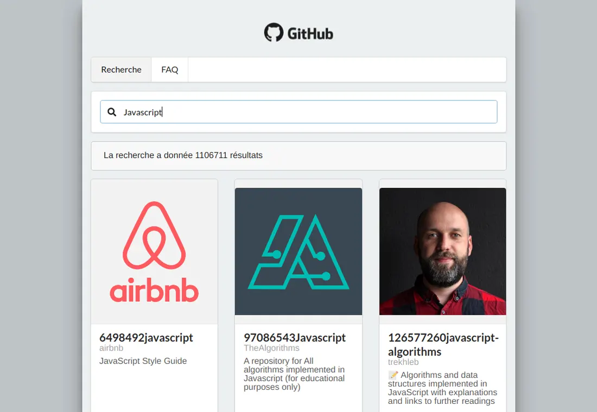

# Annuaire Github + API

## Réalisation 

Annuaire listant des repository sur GitHub via une API fourni par ce dernier. Développer avec la bibliothèque REACT, utilisation de Axios et des formulaires de recherche.

Utilisation du framework CSS Semantic-UI pour la mise en forme.




## Développement

Vous souhaitez exécuter une démo local

```bash
git clone https://github.com/viktk/githubapi-viktk
npm install
npm start
url : http://localhost:8080
```